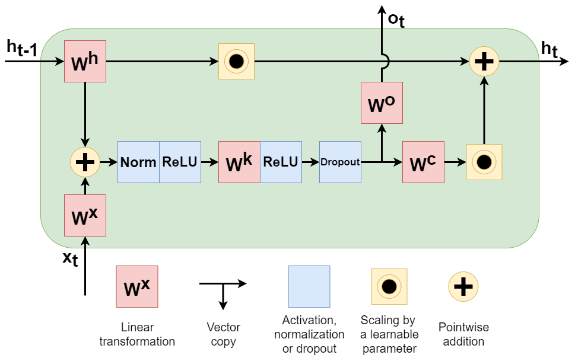

# Gates are not what you need in RNNs
This repository contains the official TensorFlow implementation of the following paper:
> **Gates are not what you need in RNNs**
> 
> by  Ronalds Zakovskis, Andis Draguns, Eliza Gaile, Emils Ozolins, Karlis Freivalds  
> 
> [[arXiv]](https://arxiv.org/abs/2108.00527)
> 
>  Abstract: _Recurrent neural networks have flourished in many areas. Consequently, we can see new RNN cells being developed continuously, usually by creating or using gates in a new, original way. But what if we told you that gates in RNNs are redundant? In this paper, we propose a new recurrent cell called 'Residual Recurrent Unit' (RRU) which beats traditional cells and does not employ a single gate. It is based on the residual function together with linear transformations, ReLU, and normalization. To evaluate our cell's effectiveness, we compare its performance against the widely-used GRU and LSTM cells and the recently proposed Mogrifier LSTM on several tasks including, polyphonic music modelling, language modelling, and sentiment analysis. Our experiments show that RRU outperforms the traditional gated units on most of these tasks. Also, it has better robustness to parameter selection, allowing immediate application in new tasks without much tuning._

We show that gates are not essential at all to construct a well-performing recurrent unit. To this end, we develop a recurrent cell not containing a single gate – the RRU. The proposed cell surpasses not only GRU and LSTM but also the currently best Mogrifier LSTM on many commonly used benchmark tasks. Our cell is based on a residual ReLU network employing normalization and ReZero recurrent state update. The structure of the RRU with two state-input linear transformations is as follows:



## Requirements

### 1. Download the data sets

To download the data sets, you must run:
```
bash get_data.sh
```

Language modeling data sets are downloaded from:

http://mattmahoney.net/dc/textdata

and

http://www.fit.vutbr.cz/~imikolov/rnnlm/ .

Music modeling data sets are downloaded from:

http://www-etud.iro.umontreal.ca/~boulanni/icml2012 .

### 2. Prepare your environment

To install requirements run:

#### 1st way (Requires CUDA 10 if you want to use the GPU version)

```
pip install -r requirements.txt
```

#### 2nd way (Requires Anaconda)


```
conda create -n RRU python=3.6.9

conda activate RRU

conda install tensorflow-gpu=1.15
pip3 install sklearn
pip3 install --upgrade --upgrade-strategy only-if-needed dm-sonnet==1.36
pip3 install hyperopt
```

## Hardware requirements

* Ubuntu 18.04 or newer
* Nvidia T4 (16Gb) or better
* 16GB of RAM

## Training & Evaluation

The models are evaluated automatically after the training has been finished.

### Sentiment Analysis
1 - To start training / validation / testing, run:
```
python -u sa_main.py
```

You change the training / validation / testing hyperparameters at the top of the "sa_main.py" file.

### Language modeling

1 - To prepare the data, run:
```
python -u lm_utils.py
```

You can change the vocabulary size for each data set in the main function in "lm_utils.py". After any changes, you must
rerun the lm_utils.py file.

2 - To start training / validation / testing, run:
```
python -u lm_main.py
```

You change the training / validation / testing hyperparameters at the top of the "lm_main.py" file.

### Music modeling

1 - To prepare the data, run:
```
python -u mm_utils.py
```

2 - To start training/validation/testing, run:
```
python -u mm_main.py
```

You change the training / validation / testing hyperparameters at the top of the "mm_main.py" file.

### MNIST image classification

1 - To start training/validation/testing, run:
```
python -u mnist_main.py
```

You change the training / validation / testing hyperparameters at the top of the "mnist_main.py" file.

## Results

Our model achieves the following performance on aforementioned data sets:

<!-- ### [Image Classification on ImageNet](https://paperswithcode.com/sota/image-classification-on-imagenet) -->

| Task                                  | Tuned | RRU        | GRU        | LSTM   | Mogrifier LSTM |
| ------------------------------------- | ----- | ---------- | ---------- | ------ | -------------- |
| Music JSB Chorales (NLL)              | +     | **7.72**   | 8.20       | 8.33   | 8.18           |
| Music Nottingham (NLL)                | +     | **2.92**   | 3.22       | 3.25   | 3.28           |
| Music MuseData (NLL)                  | +     | **7.03**   | 7.31       | 7.24   | 7.22           |
| Music Piano-midi.de (NLL)             | +     | **7.38**   | 7.58       | 7.54   | 7.52           |
| Word-level Penn Treebank (Perplexity) | +     | **102.56** | 122.21     | 140.35 | 126.88         |
| Character-level Penn Treebank (BPC)   | +/-   | **1.27**   | 1.28       | 1.34   | 1.29           |
| Character-level enwik8 (BPC)          | -     | 1.37       | 1.53       | 1.49   | **1.36**       |
| Character-level text8 (BPC)           | -     | **1.35**   | 1.55       | 1.44   | 1.37           |
| Sentiment analysis IMDB (Accuracy)    | -     | **87.20**  | 87.04      | 85.89  | 86.23          |
| Sequential MNIST (Accuracy)           | -     | **98.74**  | 98.36      | 92.88  | 98.14          |
| Permuted MNIST (Accuracy)             | -     | 97.67      | **98.68**  | 97.39  | 97.81          |

## Contributing
For help or issues, please submit a GitHub issue.
For personal communications, please contact Ronalds Zakovskis (ronalds.zakovskis@lumii.lv).
